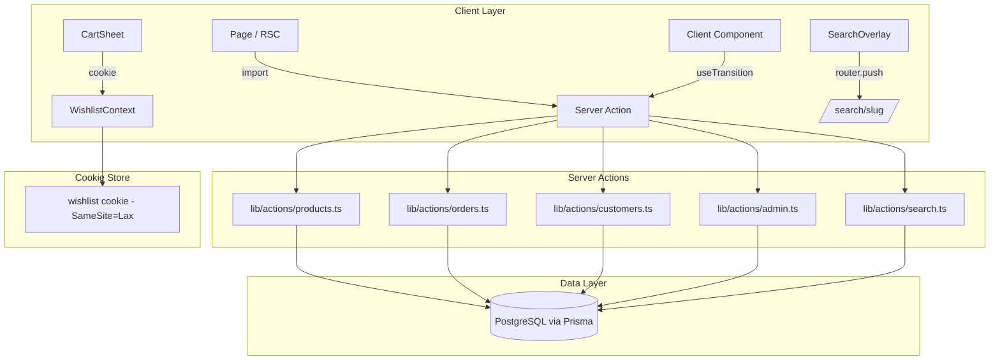
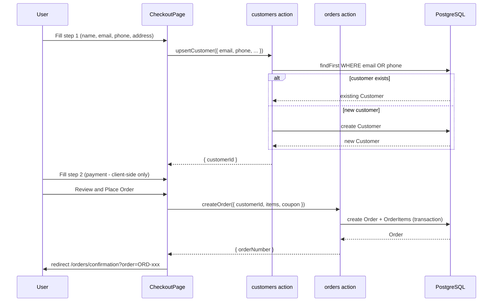
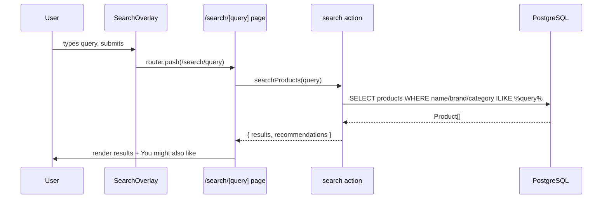

# Design Document: E-Commerce Functionality

## Overview

This document covers six interconnected feature areas that together complete the e-commerce functionality of the Next.js luxury store application: Prisma v7 upgrade, Server Actions architecture, Customer schema with checkout integration, Search overlay with URL routing, Cart sheet responsive layout fix, and a cookie-based Wishlist feature.

The application uses Next.js 16 App Router, Prisma 7 + PostgreSQL, TypeScript, Tailwind CSS v4, and shadcn/ui. All pages currently use mock data; this spec replaces mock data with real database queries via Server Actions, adds the Customer model, and delivers the remaining UI features.

The six areas are designed to be implemented in dependency order: Prisma upgrade first (foundation), then Server Actions (data layer), then Customer/Checkout (uses actions), then Search (uses actions), then Cart fix and Wishlist (UI-only, can be parallelised).

---

## Architecture



---

## Sequence Diagrams

### Checkout Flow (Customer + Order Creation)



### Search Flow



---

## Components and Interfaces

### 1. Server Actions Layer (`lib/actions/`)

All database reads and writes. Called directly from RSCs or via `useTransition` from client components.

```typescript
// lib/actions/products.ts
export async function getProducts(opts?: { categorySlug?: string; limit?: number }): Promise<Product[]>
export async function getProductBySlug(slug: string): Promise<ProductWithVariants | null>
export async function getFeaturedProducts(limit?: number): Promise<Product[]>
export async function getRecommendations(productId: string, limit?: number): Promise<Product[]>

// lib/actions/search.ts
export async function searchProducts(query: string): Promise<{ results: Product[]; recommendations: Product[] }>

// lib/actions/customers.ts
export async function upsertCustomer(data: CustomerInput): Promise<Customer>

// lib/actions/orders.ts
export async function createOrder(data: CreateOrderInput): Promise<Order>
export async function getOrderByNumber(orderNumber: string): Promise<Order | null>

// lib/actions/admin.ts
export async function adminGetProducts(): Promise<AdminProduct[]>
export async function adminCreateProduct(data: ProductInput): Promise<Product>
export async function adminUpdateProduct(id: string, data: Partial<ProductInput>): Promise<Product>
export async function adminDeleteProduct(id: string): Promise<void>
export async function adminToggleProductVisibility(id: string): Promise<Product>
export async function adminGetOrders(status?: string): Promise<AdminOrder[]>
export async function adminUpdateOrderStatus(id: string, status: OrderStatus): Promise<Order>
export async function adminGetBrands(): Promise<Brand[]>
export async function adminCreateBrand(data: BrandInput): Promise<Brand>
export async function adminUpdateBrand(id: string, data: Partial<BrandInput>): Promise<Brand>
export async function adminDeleteBrand(id: string): Promise<void>
export async function adminGetCategories(): Promise<Category[]>
export async function adminCreateCategory(data: CategoryInput): Promise<Category>
export async function adminUpdateCategory(id: string, data: Partial<CategoryInput>): Promise<Category>
export async function adminDeleteCategory(id: string): Promise<void>
```

### 2. Wishlist (`lib/wishlist-context.tsx`)

Device-local wishlist stored in a cookie. Exposed via React context.

```typescript
interface WishlistItem {
  variantId: string
  productId: string
  name: string
  image: string
  price: number
  slug: string
}

interface WishlistContextType {
  items: WishlistItem[]
  addItem: (item: WishlistItem) => void
  removeItem: (variantId: string) => void
  toggleItem: (item: WishlistItem) => void
  isInWishlist: (variantId: string) => boolean
  clearWishlist: () => void
}
```

### 3. CartSheet (responsive fix)

Slide-up drawer on mobile (below `sm` breakpoint), slide-in sheet from right on `sm:` and above. Uses the existing `useIsMobile` hook from `hooks/use-mobile.ts`.

```typescript
// components/cart-sheet.tsx
interface CartSheetProps {
  isOpen: boolean
  onClose: () => void
}
// Renders Drawer (vaul) when isMobile === true
// Renders Sheet (shadcn) with side="right" when isMobile === false
```

### 4. Search Page (`app/search/[query]/`)

```typescript
// app/search/[query]/page.tsx  -- RSC
interface SearchPageProps {
  params: { query: string }
}
// Calls searchProducts(decodeURIComponent(params.query))
// Renders results grid + ProductRecommendation section
```

### 5. WishlistSheet (`components/wishlist-sheet.tsx`)

```typescript
interface WishlistSheetProps {
  isOpen: boolean
  onClose: () => void
}
// Checklist of wishlist items with per-item checkboxes
// Bulk actions: "Remove selected" and "Add selected to cart"
```

---

## Data Models

### New `Customer` model

```prisma
model Customer {
  id        String   @id @default(cuid())
  firstName String
  lastName  String
  email     String   @unique
  phone     String   @unique
  address   String?
  city      String?
  state     String?
  zip       String?
  createdAt DateTime @default(now())
  updatedAt DateTime @updatedAt

  orders    Order[]

  @@map("customers")
}
```

### Updated `Order` model

Replaces `userId`/`User` relation with `customerId`/`Customer`. Adds `shippingCost` field and promotes `status` to an enum.

```prisma
enum OrderStatus {
  PENDING
  PROCESSING
  SHIPPED
  DELIVERED
  CANCELLED
}

model Order {
  id           String      @id @default(cuid())
  orderNumber  String      @unique
  status       OrderStatus @default(PENDING)
  subtotal     Float
  tax          Float       @default(0)
  discount     Float       @default(0)
  shippingCost Float       @default(0)
  total        Float
  createdAt    DateTime    @default(now())
  updatedAt    DateTime    @updatedAt

  customerId   String
  customer     Customer    @relation(fields: [customerId], references: [id])

  items        OrderItem[]
  couponCode   String?

  @@map("orders")
}
```

### Updated `lib/prisma.ts` (Prisma v7)

Prisma 7 generates the client to a local output path rather than `node_modules/@prisma/client`. The singleton and import path must be updated accordingly.

```typescript
// lib/prisma.ts
import { PrismaClient } from '../prisma/generated/prisma'

const globalForPrisma = globalThis as unknown as { prisma: PrismaClient }

export const prisma =
  globalForPrisma.prisma ??
  new PrismaClient({
    log: process.env.NODE_ENV === 'development' ? ['query', 'error', 'warn'] : ['error'],
  })

if (process.env.NODE_ENV !== 'production') globalForPrisma.prisma = prisma

export default prisma
```

Updated `schema.prisma` generator block:

```prisma
generator client {
  provider = "prisma-client-js"
  output   = "../prisma/generated/prisma"
}
```

---

## Algorithmic Pseudocode

### upsertCustomer

```pascal
PROCEDURE upsertCustomer(data: CustomerInput): Customer
  INPUT: data { firstName, lastName, email, phone, address?, city?, state?, zip? }
  OUTPUT: Customer record

  SEQUENCE
    normEmail <- data.email.toLowerCase().trim()
    normPhone <- stripNonDigits(data.phone)  // keep only 0-9, E.164 style

    existing <- db.customer.findFirst(
      WHERE email = normEmail OR phone = normPhone
    )

    IF existing IS NOT NULL THEN
      RETURN db.customer.update(
        WHERE id = existing.id,
        DATA { ...data, email: normEmail, phone: normPhone }
      )
    ELSE
      RETURN db.customer.create(
        DATA { ...data, email: normEmail, phone: normPhone }
      )
    END IF
  END SEQUENCE
END PROCEDURE
```

**Preconditions:** `data.email` is a valid email; `data.phone` contains at least 10 digits after stripping.
**Postconditions:** Exactly one Customer row exists for the normalised email/phone pair; returned Customer has a valid `id`.

### createOrder

```pascal
PROCEDURE createOrder(data: CreateOrderInput): Order
  INPUT: data { customerId, items[], couponCode? }
  OUTPUT: Order record

  SEQUENCE
    BEGIN TRANSACTION
      FOR each item IN data.items DO
        variant <- db.productVariant.findUnique(WHERE id = item.variantId)
        IF variant IS NULL OR variant.stock < item.quantity THEN
          ROLLBACK
          THROW InsufficientStockError(item.variantId)
        END IF
      END FOR

      discount <- 0
      IF data.couponCode IS NOT NULL THEN
        coupon <- db.coupon.findFirst(
          WHERE code = data.couponCode
            AND isActive = true
            AND (expiresAt IS NULL OR expiresAt > NOW())
            AND (maxUses IS NULL OR usedCount < maxUses)
        )
        IF coupon IS NOT NULL THEN
          discount <- calculateDiscount(coupon, subtotal)
          db.coupon.update(WHERE id = coupon.id, DATA { usedCount: usedCount + 1 })
        END IF
      END IF

      subtotal <- SUM(item.price * item.quantity FOR item IN data.items)
      tax      <- subtotal * TAX_RATE
      shipping <- IF subtotal > FREE_SHIPPING_THRESHOLD THEN 0 ELSE FLAT_SHIPPING
      total    <- subtotal + tax + shipping - discount

      order <- db.order.create({
        orderNumber: generateOrderNumber(),
        customerId:  data.customerId,
        subtotal, tax, discount, shippingCost: shipping, total,
        couponCode: data.couponCode,
        items: { createMany: data.items }
      })

      FOR each item IN data.items DO
        db.productVariant.update(
          WHERE id = item.variantId,
          DATA { stock: { decrement: item.quantity } }
        )
      END FOR
    COMMIT TRANSACTION

    RETURN order
  END SEQUENCE
END PROCEDURE
```

**Preconditions:** `customerId` references an existing Customer; all variants exist with sufficient stock.
**Postconditions:** Order and OrderItems created atomically; stock decremented; coupon usedCount incremented if applied.
**Loop Invariants:** Stock check loop — all previously validated variants still have sufficient stock within the same transaction.

### searchProducts

```pascal
PROCEDURE searchProducts(query: string): SearchResult
  INPUT: query -- raw URL-decoded search string
  OUTPUT: { results: Product[], recommendations: Product[] }

  SEQUENCE
    term <- query.trim()
    IF term.length < 2 THEN
      RETURN { results: [], recommendations: [] }
    END IF

    results <- db.product.findMany(
      WHERE isVisible = true AND (
        name          ILIKE '%' + term + '%' OR
        brand.name    ILIKE '%' + term + '%' OR
        category.name ILIKE '%' + term + '%'
      ),
      INCLUDE { brand, category, variants: { WHERE isVisible = true, TAKE 1 } },
      ORDER BY name ASC
    )

    resultIds   <- SET(result.id FOR result IN results)
    categoryIds <- SET(result.categoryId FOR result IN results)

    recommendations <- db.product.findMany(
      WHERE isVisible = true
        AND categoryId IN categoryIds
        AND id NOT IN resultIds,
      TAKE 8,
      ORDER BY RANDOM()
    )

    RETURN { results, recommendations }
  END SEQUENCE
END PROCEDURE
```

**Preconditions:** `query` is a non-empty URL-decoded string.
**Postconditions:** `results` contains only visible products matching the query; `recommendations` contains visible products from the same categories not already in results; `recommendations.length <= 8`.

---

## Example Usage

### RSC calling a Server Action directly

```typescript
// app/page.tsx
import { getFeaturedProducts } from '@/lib/actions/products'

export default async function Home() {
  const products = await getFeaturedProducts(8)
  return <ProductGrid products={products} />
}
```

### Client component calling a Server Action via useTransition

```typescript
// components/checkout-step1.tsx
'use client'
import { useTransition } from 'react'
import { upsertCustomer } from '@/lib/actions/customers'

export function CheckoutStep1({ onSuccess }: { onSuccess: (id: string) => void }) {
  const [isPending, startTransition] = useTransition()

  const handleSubmit = (data: CustomerInput) => {
    startTransition(async () => {
      const customer = await upsertCustomer(data)
      onSuccess(customer.id)
    })
  }
}
```

### Search page (RSC)

```typescript
// app/search/[query]/page.tsx
import { searchProducts } from '@/lib/actions/search'
import { ProductRecommendation } from '@/components/product-recommendation'

export default async function SearchPage({ params }: { params: { query: string } }) {
  const q = decodeURIComponent(params.query)
  const { results, recommendations } = await searchProducts(q)
  return (
    <>
      <SearchResults query={q} results={results} />
      <ProductRecommendation products={recommendations} />
    </>
  )
}
```

### Responsive CartSheet

```typescript
// components/cart-sheet.tsx
'use client'
import { useIsMobile } from '@/hooks/use-mobile'
import { Sheet, SheetContent } from '@/components/ui/sheet'
import { Drawer, DrawerContent } from '@/components/ui/drawer'

export function CartSheet({ isOpen, onClose }: CartSheetProps) {
  const isMobile = useIsMobile()  // returns true when width < 640px

  if (isMobile) {
    return (
      <Drawer open={isOpen} onOpenChange={onClose}>
        <DrawerContent>{/* shared cart body */}</DrawerContent>
      </Drawer>
    )
  }

  return (
    <Sheet open={isOpen} onOpenChange={onClose}>
      <SheetContent side="right" className="w-[500px]">{/* shared cart body */}</SheetContent>
    </Sheet>
  )
}
```

### Wishlist cookie read/write

```typescript
// lib/wishlist-context.tsx  (client)
const COOKIE_KEY = 'wishlist'
const MAX_AGE = 60 * 60 * 24 * 30  // 30 days

function readCookie(): WishlistItem[] {
  if (typeof document === 'undefined') return []
  try {
    const match = document.cookie.match(/(?:^|;\s*)wishlist=([^;]*)/)
    return match ? JSON.parse(decodeURIComponent(match[1])) : []
  } catch {
    return []
  }
}

function writeCookie(items: WishlistItem[]): void {
  document.cookie =
    `${COOKIE_KEY}=${encodeURIComponent(JSON.stringify(items))}; path=/; max-age=${MAX_AGE}; SameSite=Lax`
}
```

---

## Correctness Properties

*A property is a characteristic or behavior that should hold true across all valid executions of a system — essentially, a formal statement about what the system should do. Properties serve as the bridge between human-readable specifications and machine-verifiable correctness guarantees.*

### Property 1: Customer uniqueness

*For any* two `upsertCustomer` calls sharing the same normalized email or phone, the function produces exactly one Customer row and returns the same `id` on both calls.

**Validates: Requirements 4.3, 4.4, 4.7**

### Property 2: Order atomicity

*For any* `createOrder` input where at least one variant has `stock` less than the requested quantity, no Order, OrderItem, stock decrement, or coupon increment is persisted to the database.

**Validates: Requirements 5.2, 5.3**

### Property 3: Search exclusivity

*For any* query Q, the intersection of `results` and `recommendations` returned by `searchProducts(Q)` is always the empty set.

**Validates: Requirements 3.5**

### Property 4: Cart sheet breakpoint

*For any* viewport with `window.innerWidth < 640px`, the `CartSheet` renders as a `Drawer` (bottom slide-up); for any viewport with `window.innerWidth >= 640px`, it renders as a `Sheet` (right-side slide-in).

**Validates: Requirements 10.1, 10.2**

### Property 5: Wishlist cookie round-trip

*For any* valid `WishlistItem[]` array, writing the array to the wishlist cookie and then reading it back produces an array deeply equal to the original.

**Validates: Requirements 11.6**

### Property 6: Prisma singleton

*For any* number of imports of `lib/prisma.ts` within a single Node.js process, at most one `PrismaClient` instance is created.

**Validates: Requirements 1.3**

---

## Error Handling

### Insufficient Stock

**Condition**: `createOrder` called with a variant whose `stock < quantity`
**Response**: Throw `InsufficientStockError`; transaction rolled back
**Recovery**: Client displays toast "Item no longer available in requested quantity"; cart remains intact

### Duplicate Customer Race Condition

**Condition**: Two concurrent `upsertCustomer` calls with the same email hit the DB simultaneously
**Response**: DB unique constraint causes one insert to fail; caught and retried as an update
**Recovery**: Transparent to user; one customer record is returned

### Search Empty Results

**Condition**: `searchProducts` returns `results: []`
**Response**: Page renders "No products found for [query]"
**Recovery**: Recommendations section still renders with products from all categories

### Wishlist Cookie Parse Failure

**Condition**: Cookie is malformed or corrupted
**Response**: `JSON.parse` throws; caught, returns `[]`
**Recovery**: Wishlist resets to empty; user notified via toast

---

## Testing Strategy

### Unit Testing

Test each Server Action with a mocked Prisma client:
- `upsertCustomer`: new customer, existing email match, existing phone match
- `createOrder`: success path, insufficient stock rollback, coupon application, free shipping threshold
- `searchProducts`: match by name / brand / category, empty query, no results, recommendations exclusion

### Property-Based Testing

**Library**: fast-check

- `upsertCustomer` idempotency: calling twice with the same email always returns the same `id`
- `searchProducts` exclusivity: for any query, `results ∩ recommendations = ∅`
- Wishlist round-trip: `readCookie(writeCookie(items))` deep-equals `items` for any valid `WishlistItem[]`

### Integration Testing

- Checkout end-to-end: step 1 → customer upserted → step 2 → place order → order created → confirmation redirect
- Search URL routing: overlay submit → `router.push(/search/query)` → correct results rendered
- Cart sheet breakpoint: resize below/above 640px → correct component (Drawer vs Sheet) mounts

---

## Performance Considerations

- Server Actions called from RSCs (home, product, search pages) avoid client-side waterfalls
- `searchProducts` uses a single Prisma query with `OR` + `ILIKE`; a `pg_trgm` GIN index on product/brand/category name columns is recommended for production scale
- Wishlist is entirely client-side (cookie) — zero DB reads for wishlist display
- `getFeaturedProducts` and `getRecommendations` results can be wrapped with `unstable_cache` for ISR-style caching

---

## Security Considerations

- Wishlist cookie uses `SameSite=Lax`; it is intentionally NOT `HttpOnly` because client JS must read it — acceptable since it contains no sensitive data
- All mutating Server Actions validate input with Zod before any DB operation
- Admin actions must be gated behind a session/auth check (middleware or per-action guard)
- Coupon discount logic runs server-side only; clients never receive the calculation
- Phone numbers normalised to digits-only before storage to prevent duplicate customers via formatting variations

---

## Dependencies

| Package | Installed | Purpose |
|---|---|---|
| `prisma` ^7.5.0 | yes | ORM + migrations |
| `@prisma/client` ^7.5.0 | yes | Generated client (output path changes in v7) |
| `zod` ^3.24.1 | yes | Server Action input validation |
| `react-hook-form` ^7.54.1 | yes | Checkout form state |
| `@hookform/resolvers` ^3.9.1 | yes | Zod resolver |
| `vaul` ^1.1.2 | yes | Drawer primitive for mobile cart |
| `next` 16.2.0 | yes | App Router + Server Actions |

No new npm packages are required.
